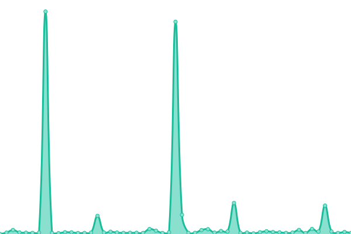

# [📈 Live Status](https://status.linwood.tk): <!--live status--> **🟧 Partial outage**

This repository contains the open-source uptime monitor and status page for [Linwood](https://linwood.tk), powered by [Upptime](https://github.com/upptime/upptime).

With [Upptime](https://upptime.js.org), you can get your own unlimited and free uptime monitor and status page, powered entirely by a GitHub repository. We use [Issues](https://github.com/LinwoodCloud/status/issues) as incident reports, [Actions](https://github.com/LinwoodCloud/status/actions) as uptime monitors, and [Pages](https://demo.upptime.js.org) for the status page.

<!--start: status pages-->
<!-- This summary is generated by Upptime (https://github.com/upptime/upptime) -->
<!-- Do not edit this manually, your changes will be overwritten -->
<!-- prettier-ignore -->
| URL | Status | History | Response Time | Uptime |
| --- | ------ | ------- | ------------- | ------ |
|  [Linwood Git](https://git.linwood.dev) | 🟥 Down | [linwood-git.yml](https://github.com/LinwoodCloud/status/commits/HEAD/history/linwood-git.yml) | 

 137ms
     
 | 

<a href="https://status.linwood.dev/history/linwood-git">100.00%</a>
    

|  [Linwood Drone](https://ci.linwood.dev) | 🟥 Down | [linwood-drone.yml](https://github.com/LinwoodCloud/status/commits/HEAD/history/linwood-drone.yml) | 

 103ms
     
 | 

<a href="https://status.linwood.dev/history/linwood-drone">100.00%</a>
    

|  [Website](https://linwood.dev) | 🟩 Up | [website.yml](https://github.com/LinwoodCloud/status/commits/HEAD/history/website.yml) | 

 365ms
     
 | 

<a href="https://status.linwood.dev/history/website">90.89%</a>
    

|  [Dev-Doctor](https://dev-doctor.linwood.dev) | 🟩 Up | [dev-doctor.yml](https://github.com/LinwoodCloud/status/commits/HEAD/history/dev-doctor.yml) | 

 184ms
     
 | 

<a href="https://status.linwood.dev/history/dev-doctor">95.45%</a>
    

|  [Dev-Doctor Docs](https://docs.dev-doctor.linwood.dev) | 🟩 Up | [dev-doctor-docs.yml](https://github.com/LinwoodCloud/status/commits/HEAD/history/dev-doctor-docs.yml) | 

 202ms
     
 | 

<a href="https://status.linwood.dev/history/dev-doctor-docs">95.58%</a>
    

|  [Linwood Launch](https://launch.linwood.dev) | 🟩 Up | [linwood-launch.yml](https://github.com/LinwoodCloud/status/commits/HEAD/history/linwood-launch.yml) | 

 172ms
     
 | 

<a href="https://status.linwood.dev/history/linwood-launch">94.24%</a>
    

|  [Linwood Launch Docs](https://launch.linwood.dev) | 🟩 Up | [linwood-launch-docs.yml](https://github.com/LinwoodCloud/status/commits/HEAD/history/linwood-launch-docs.yml) | 

 17ms
     
 | 

<a href="https://status.linwood.dev/history/linwood-launch-docs">94.24%</a>
    

|  [Linwood Flow](https://flow.linwood.dev) | 🟩 Up | [linwood-flow.yml](https://github.com/LinwoodCloud/status/commits/HEAD/history/linwood-flow.yml) | 

 227ms
     
 | 

<a href="https://status.linwood.dev/history/linwood-flow">94.68%</a>
    

|  [Linwood Flow Docs](https://docs.flow.linwood.dev) | 🟩 Up | [linwood-flow-docs.yml](https://github.com/LinwoodCloud/status/commits/HEAD/history/linwood-flow-docs.yml) | 

 302ms
     
 | 

<a href="https://status.linwood.dev/history/linwood-flow-docs">96.93%</a>
    

|  [GitHub](https://github.com) | 🟩 Up | [git-hub.yml](https://github.com/LinwoodCloud/status/commits/HEAD/history/git-hub.yml) | 

 147ms
     
 | 

<a href="https://status.linwood.dev/history/git-hub">100.00%</a>
    

|  [Discord](https://discord.com) | 🟩 Up | [discord.yml](https://github.com/LinwoodCloud/status/commits/HEAD/history/discord.yml) | 

 75ms
     
 | 

<a href="https://status.linwood.dev/history/discord">100.00%</a>
    

|  [Vercel](https://vercel.com) | 🟩 Up | [vercel.yml](https://github.com/LinwoodCloud/status/commits/HEAD/history/vercel.yml) | 

 161ms
     
 | 

<a href="https://status.linwood.dev/history/vercel">100.00%</a>
    

<!--end: status pages-->

[**Visit our status website →**](https://status.linwood.tk)

## 📄 License

- Powered by: [Upptime](https://github.com/upptime/upptime)
- Code: [MIT](./LICENSE) © [Linwood](https://linwood.tk)
- Data in the `./history` directory: [Open Database License](https://opendatacommons.org/licenses/odbl/1-0/)
