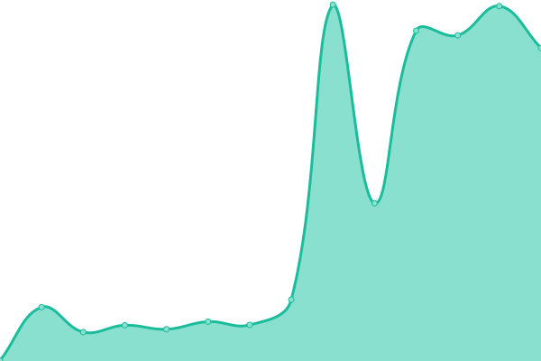

# [📈 Live Status](https://status.linwood.tk): <!--live status--> **🟧 Partial outage**

This repository contains the open-source uptime monitor and status page for [Linwood](https://linwood.dev), powered by [Upptime](https://github.com/upptime/upptime).

With [Upptime](https://upptime.js.org), you can get your own unlimited and free uptime monitor and status page, powered entirely by a GitHub repository. We use [Issues](https://github.com/LinwoodCloud/status/issues) as incident reports, [Actions](https://github.com/LinwoodCloud/status/actions) as uptime monitors, and [Pages](https://demo.upptime.js.org) for the status page.

<!--start: status pages-->
<!-- This summary is generated by Upptime (https://github.com/upptime/upptime) -->
<!-- Do not edit this manually, your changes will be overwritten -->
<!-- prettier-ignore -->
| URL | Status | History | Response Time | Uptime |
| --- | ------ | ------- | ------------- | ------ |
|  [Linwood Git](https://git.linwood.dev) | 🟥 Down | [linwood-git.yml](https://github.com/LinwoodCloud/status/commits/HEAD/history/linwood-git.yml) | 

 112ms
     
 | 

<a href="https://status.linwood.dev/history/linwood-git">100.00%</a>
    

|  [Linwood Drone](https://ci.linwood.dev) | 🟥 Down | [linwood-drone.yml](https://github.com/LinwoodCloud/status/commits/HEAD/history/linwood-drone.yml) | 

 115ms
     
 | 

<a href="https://status.linwood.dev/history/linwood-drone">100.00%</a>
    

|  [Website](https://linwood.dev) | 🟩 Up | [website.yml](https://github.com/LinwoodCloud/status/commits/HEAD/history/website.yml) | 

 269ms
     
 | 

<a href="https://status.linwood.dev/history/website">100.00%</a>
    

|  [Butterfly](https://butterfly.linwood.dev) | 🟩 Up | [butterfly.yml](https://github.com/LinwoodCloud/status/commits/HEAD/history/butterfly.yml) | 

 105ms
     
 | 

<a href="https://status.linwood.dev/history/butterfly">100.00%</a>
    

|  [Butterfly Docs](https://docs.butterfly.linwood.dev) | 🟩 Up | [butterfly-docs.yml](https://github.com/LinwoodCloud/status/commits/HEAD/history/butterfly-docs.yml) | 

 72ms
     
 | 

<a href="https://status.linwood.dev/history/butterfly-docs">100.00%</a>
    

|  [Dev-Doctor](https://dev-doctor.linwood.dev) | 🟥 Down | [dev-doctor.yml](https://github.com/LinwoodCloud/status/commits/HEAD/history/dev-doctor.yml) | 

 72ms
     
 | 

<a href="https://status.linwood.dev/history/dev-doctor">99.38%</a>
    

|  [Dev-Doctor Docs](https://docs.dev-doctor.linwood.dev) | 🟩 Up | [dev-doctor-docs.yml](https://github.com/LinwoodCloud/status/commits/HEAD/history/dev-doctor-docs.yml) | 

 687ms
     
 | 

<a href="https://status.linwood.dev/history/dev-doctor-docs">99.23%</a>
    

|  [GitHub](https://github.com) | 🟩 Up | [git-hub.yml](https://github.com/LinwoodCloud/status/commits/HEAD/history/git-hub.yml) | 

 58ms
     
 | 

<a href="https://status.linwood.dev/history/git-hub">100.00%</a>
    

|  [Vercel](https://vercel.com) | 🟩 Up | [vercel.yml](https://github.com/LinwoodCloud/status/commits/HEAD/history/vercel.yml) | 

 93ms
     
 | 

<a href="https://status.linwood.dev/history/vercel">99.42%</a>
    

<!--end: status pages-->

[**Visit our status website →**](https://status.linwood.dev)

## 📄 License

- Powered by: [Upptime](https://github.com/upptime/upptime)
- Code: [MIT](./LICENSE) © [Linwood](https://linwood.dev)
- Data in the `./history` directory: [Open Database License](https://opendatacommons.org/licenses/odbl/1-0/)
