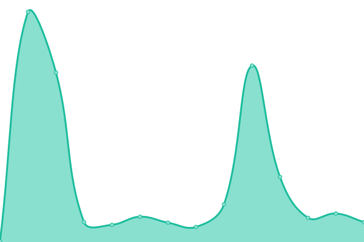
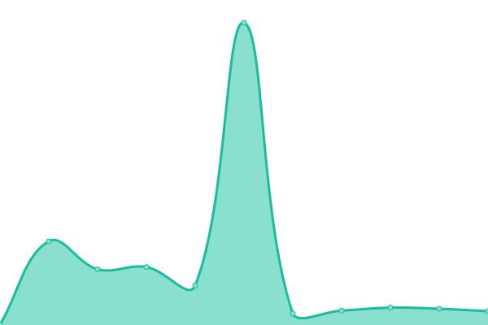

# [📈 Live Status](https://status.linwood.tk): <!--live status--> **🟧 Partial outage**

This repository contains the open-source uptime monitor and status page for [Linwood](https://linwood.dev), powered by [Upptime](https://github.com/upptime/upptime).

With [Upptime](https://upptime.js.org), you can get your own unlimited and free uptime monitor and status page, powered entirely by a GitHub repository. We use [Issues](https://github.com/LinwoodCloud/status/issues) as incident reports, [Actions](https://github.com/LinwoodCloud/status/actions) as uptime monitors, and [Pages](https://demo.upptime.js.org) for the status page.

<!--start: status pages-->
<!-- This summary is generated by Upptime (https://github.com/upptime/upptime) -->
<!-- Do not edit this manually, your changes will be overwritten -->
<!-- prettier-ignore -->
| URL | Status | History | Response Time | Uptime |
| --- | ------ | ------- | ------------- | ------ |
|  [Linwood Git](https://git.linwood.dev) | 🟩 Up | [linwood-git.yml](https://github.com/LinwoodCloud/status/commits/HEAD/history/linwood-git.yml) | 

 453ms
     
 | 

<a href="https://status.linwood.dev/history/linwood-git">100.00%</a>
    

|  [Linwood CI](https://ci.linwood.dev) | 🟩 Up | [linwood-ci.yml](https://github.com/LinwoodCloud/status/commits/HEAD/history/linwood-ci.yml) | 

 1057ms
     
 | 

<a href="https://status.linwood.dev/history/linwood-ci">100.00%</a>
    

|  [Website](https://linwood.dev) | 🟩 Up | [website.yml](https://github.com/LinwoodCloud/status/commits/HEAD/history/website.yml) | 

 177ms
     
 | 

<a href="https://status.linwood.dev/history/website">100.00%</a>
    

|  [Butterfly](https://butterfly.linwood.dev) | 🟩 Up | [butterfly.yml](https://github.com/LinwoodCloud/status/commits/HEAD/history/butterfly.yml) | 

 101ms
     
 | 

<a href="https://status.linwood.dev/history/butterfly">100.00%</a>
    

|  [Butterfly Docs](https://docs.butterfly.linwood.dev) | 🟩 Up | [butterfly-docs.yml](https://github.com/LinwoodCloud/status/commits/HEAD/history/butterfly-docs.yml) | 

 77ms
     
 | 

<a href="https://status.linwood.dev/history/butterfly-docs">97.29%</a>
    

|  [Butterfly Nightly](https://preview.butterfly.linwood.dev) | 🟥 Down | [butterfly-nightly.yml](https://github.com/LinwoodCloud/status/commits/HEAD/history/butterfly-nightly.yml) | 

 108ms
     
 | 

<a href="https://status.linwood.dev/history/butterfly-nightly">86.68%</a>
    

|  [Dev-Doctor](https://dev-doctor.linwood.dev) | 🟩 Up | [dev-doctor.yml](https://github.com/LinwoodCloud/status/commits/HEAD/history/dev-doctor.yml) | 

 178ms
     
 | 

<a href="https://status.linwood.dev/history/dev-doctor">93.74%</a>
    

|  [Dev-Doctor Docs](https://docs.dev-doctor.linwood.dev) | 🟩 Up | [dev-doctor-docs.yml](https://github.com/LinwoodCloud/status/commits/HEAD/history/dev-doctor-docs.yml) | 

 361ms
     
 | 

<a href="https://status.linwood.dev/history/dev-doctor-docs">93.53%</a>
    

|  [Dev-Doctor Nightly](https://preview.dev-doctor.linwood.dev) | 🟩 Up | [dev-doctor-nightly.yml](https://github.com/LinwoodCloud/status/commits/HEAD/history/dev-doctor-nightly.yml) | 

 186ms
     
 | 

<a href="https://status.linwood.dev/history/dev-doctor-nightly">88.24%</a>
    

<!--end: status pages-->

[**Visit our status website →**](https://status.linwood.dev)

## 📄 License

- Powered by: [Upptime](https://github.com/upptime/upptime)
- Code: [MIT](./LICENSE) © [Linwood](https://linwood.dev)
- Data in the `./history` directory: [Open Database License](https://opendatacommons.org/licenses/odbl/1-0/)
